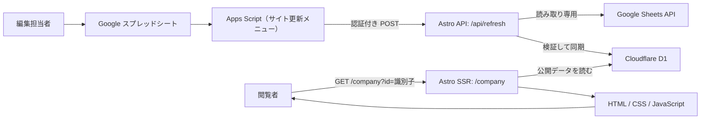
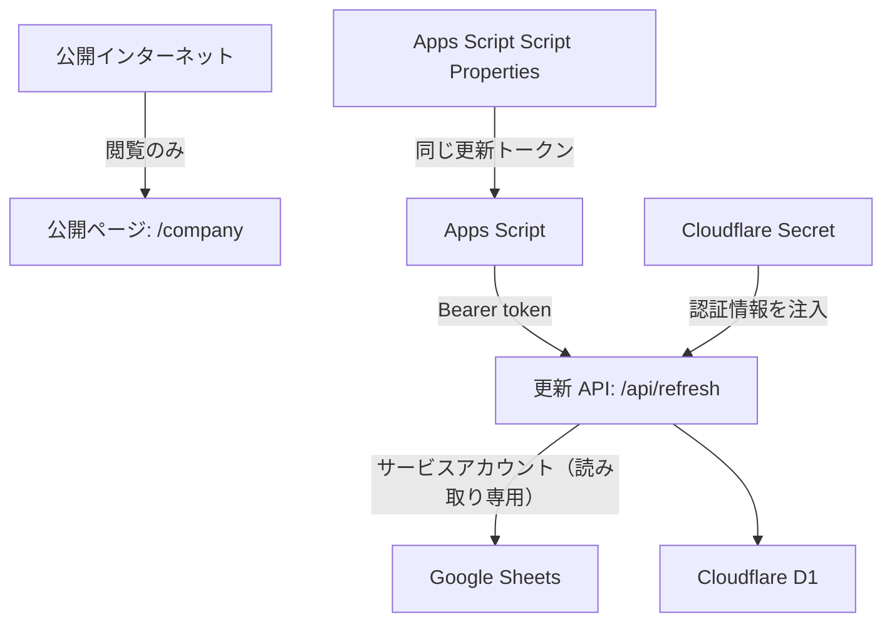

# アーキテクチャ

## このサイトの考え方

このサイトは、非エンジニアが Google スプレッドシートで会社情報と QA を編集し、メニューの「今すぐ反映する」を押すだけで公開内容を更新できる仕組みです。

スプレッドシートを閲覧時に直接読むのではなく、更新時に Cloudflare D1 へ同期します。公開ページは D1 だけを読んで表示するため、Google API の応答時間や一時的な障害が閲覧者に影響しにくくなります。



## 構成要素と役割

| 構成要素                       | 役割                                                    | 主な利用者          |
| ------------------------------ | ------------------------------------------------------- | ------------------- |
| Google スプレッドシート        | 会社情報・共通 QA・会社別 QA を編集する CMS             | 編集担当者          |
| Google Apps Script             | スプレッドシートのメニューから更新 API を呼ぶ           | 編集担当者          |
| Google Sheets API              | スプレッドシートの内容を取得する API                    | 更新 API            |
| Cloudflare Worker + Astro      | QA ページの SSR と更新 API を提供する                   | 閲覧者、Apps Script |
| Cloudflare D1                  | 公開する会社情報と QA の保存先                          | Worker              |
| Cloudflare の環境変数 / Secret | D1、Google、更新 API 用の設定・認証情報を Worker に渡す | 運用担当者          |

## 2 つの処理の流れ

### 1. 公開ページを表示する流れ

1. 閲覧者が `https://<公開URL>/company?id=<識別子>` を開きます。
2. `src/pages/company.astro` が `id` を受け取ります。
3. D1 の `companies` から、識別子が一致し、かつ `公開 = TRUE` の会社を取得します。
4. D1 の `common_qa` と、その会社の `company_qa` を取得します。
5. 共通 QA を先、会社別 QA を後にしてカテゴリごとにまとめ、HTML をサーバーで生成します。
6. 検索・カテゴリ絞り込みは外部 JavaScript、アコーディオンの開閉はネイティブの `<details>/<summary>` と CSS が担当します。

会社が存在しない、または非公開の場合は `404` を返します。閲覧時に Google Sheets API は呼びません。

### 2. スプレッドシートの内容を反映する流れ

1. 編集担当者がスプレッドシートで内容を変更します。
2. 「サイト更新」メニューから「今すぐ反映する」を実行します。
3. Apps Script が `POST /api/refresh` を呼びます。`REFRESH_TOKEN` は HTTP ヘッダーにだけ送ります。
4. `src/pages/api/refresh.ts` が認証とレート制限を確認します。
5. Worker がサービスアカウントとして Google Sheets API に接続し、必要なシートを取得します。
6. 識別子、必須列、個別 QA タブの対応関係を検証します。不正な内容なら D1 は更新せず、エラーを返します。
7. 検証に成功した内容を D1 に同期します。
8. 次のページ表示から D1 の新しい内容が使われます。**コンテンツ更新だけでビルドやデプロイは不要です。**

## データの持ち方

### スプレッドシート

1 つのスプレッドシートを、次のタブ構成で使います。

```text
設定                    会社ごとの基本情報
共通QA                  全会社に表示する QA
個別QA_<識別子>         その会社だけに表示する QA
_個別QAテンプレ          新しい会社用のコピー元（非表示）
```

`設定` の `識別子` は、URL の `?id=` と個別 QA タブ名の両方に使う半角英数字の一意な値です。たとえば識別子が `abc` の会社は、`/company?id=abc` と `個別QA_abc` が対応します。

### D1

| テーブル     | 内容                     | 表示時の扱い                  |
| ------------ | ------------------------ | ----------------------------- |
| `companies`  | 会社の基本情報と公開状態 | `slug`（識別子）で 1 社を取得 |
| `common_qa`  | 共通 QA                  | すべての公開会社に表示        |
| `company_qa` | 会社別 QA                | 該当する会社だけに表示        |

QA の表示順は、スプレッドシートの行順です。同期時に追加される D1 の `id` を使い、共通 QA、会社別 QA の順で表示します。同じカテゴリ名の QA は 1 つのカテゴリにまとまります。会社別 QA は共通 QA を上書き・削除せず、後ろに追加されます。

## 公開・非公開の扱い

スプレッドシートの `公開` 列で公開範囲を制御します。

| 対象      | `公開 = TRUE`                | `公開 = FALSE` |
| --------- | ---------------------------- | -------------- |
| 会社      | URL から表示できる           | `404` になる   |
| 共通 QA   | すべての公開会社に表示される | 表示されない   |
| 会社別 QA | 対象会社に表示される         | 表示されない   |

非公開は「公開ページに表示しない」ための設定です。スプレッドシートや D1 からデータを削除する設定ではありません。

## セキュリティ上の境界



- 公開ページは匿名閲覧を許可します。
- 更新 API は Bearer トークンが一致する Apps Script だけを想定しています。
- Google サービスアカウントはスプレッドシートを読むだけです。
- `GOOGLE_SERVICE_ACCOUNT_KEY` と `REFRESH_TOKEN` は Cloudflare Secret に保存し、Git・URL・ソースコードには置きません。
- すべての Astro ルートはミドルウェアで CSP などのセキュリティヘッダーを付与します。詳細は [security.md](./security.md) を参照してください。

## なぜこの構成か

| 選択                               | 理由                                                              |
| ---------------------------------- | ----------------------------------------------------------------- |
| スプレッドシートを 1 つに集約      | 編集者が扱いやすく、更新 API も 1 回の取得で全社分を同期できる    |
| D1 を公開用データベースにする      | 閲覧ごとに外部 API を呼ばず、更新直後の内容を一貫して表示できる   |
| `/company?id=<識別子>` の 1 ルート | 会社を増やしても Astro のページファイルやデプロイ設定を増やさない |
| Apps Script のメニュー             | 編集者が URL・認証ヘッダー・コマンドを扱わずに更新できる          |
| SSR                                | リクエスト時に D1 の最新データを HTML に反映できる                |

## 新しい会社を追加する場合

コードの変更や再デプロイは不要です。

1. `設定` シートに会社情報を 1 行追加し、重複しない半角英数字の識別子を設定する。
2. `_個別QAテンプレ` をコピーし、`個別QA_<識別子>` に名前を変更する。
3. 必要なら会社別 QA を入力する。
4. 「サイト更新」から反映する。
5. `/company?id=<識別子>` を開いて確認する。

## 主なファイル

| ファイル                    | 役割                                          |
| --------------------------- | --------------------------------------------- |
| `src/pages/company.astro`   | QA ページの SSR、D1 の読み取り、HTML の生成   |
| `src/scripts/company.ts`    | 検索・カテゴリ絞り込みのブラウザ操作          |
| `src/pages/api/refresh.ts`  | Google Sheets 取得、検証、D1 同期             |
| `src/middleware.ts`         | セキュリティヘッダーの付与                    |
| `wrangler.jsonc`            | Worker、D1、レート制限、静的アセットの設定    |
| `worker-configuration.d.ts` | Cloudflare バインディングの TypeScript 型定義 |

## 開発環境と本番環境

ローカル開発では `.dev.vars` とローカル D1 を使います。本番では Cloudflare に登録した D1 と環境変数 / Secret を使います。この 2 つは別のデータベース・設定であり、ローカルで更新したデータが自動的に本番へ反映されることはありません。

設定方法やデプロイ手順は [setup.md](./setup.md) を参照してください。
